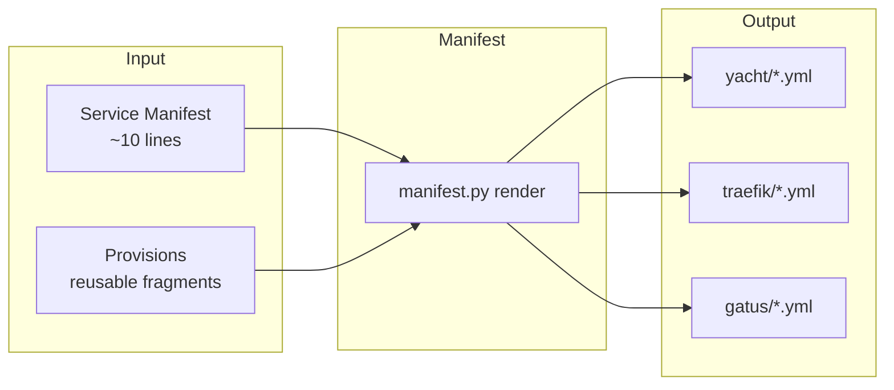
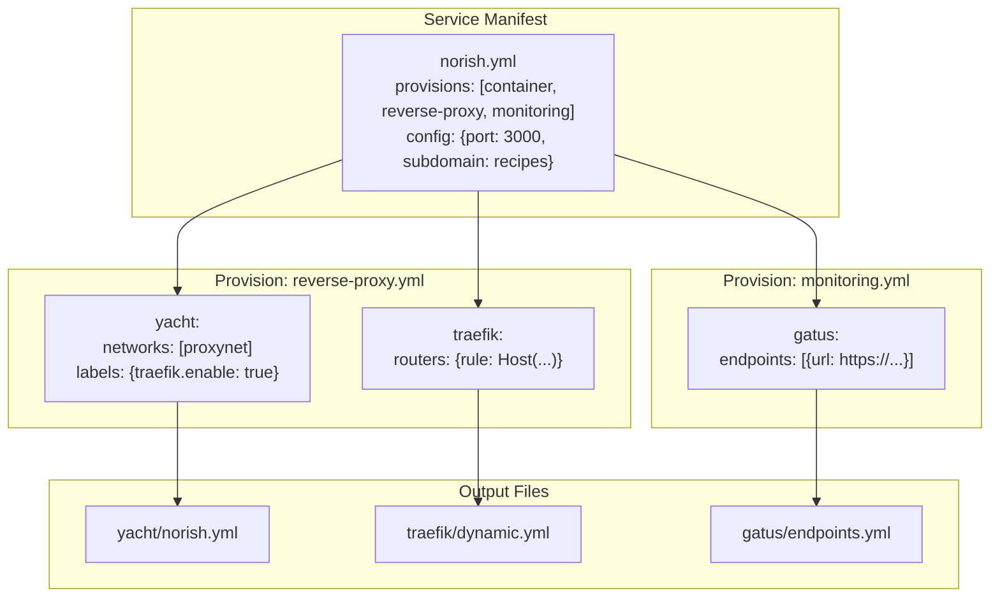
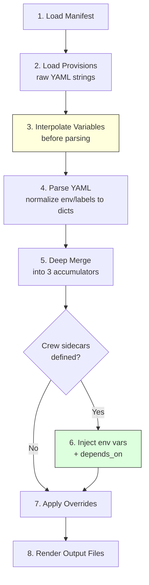
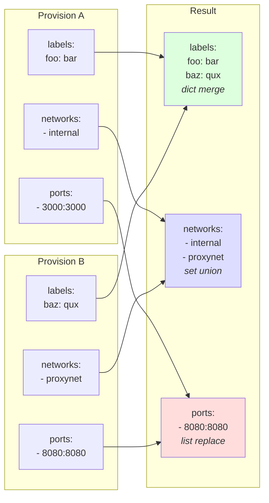
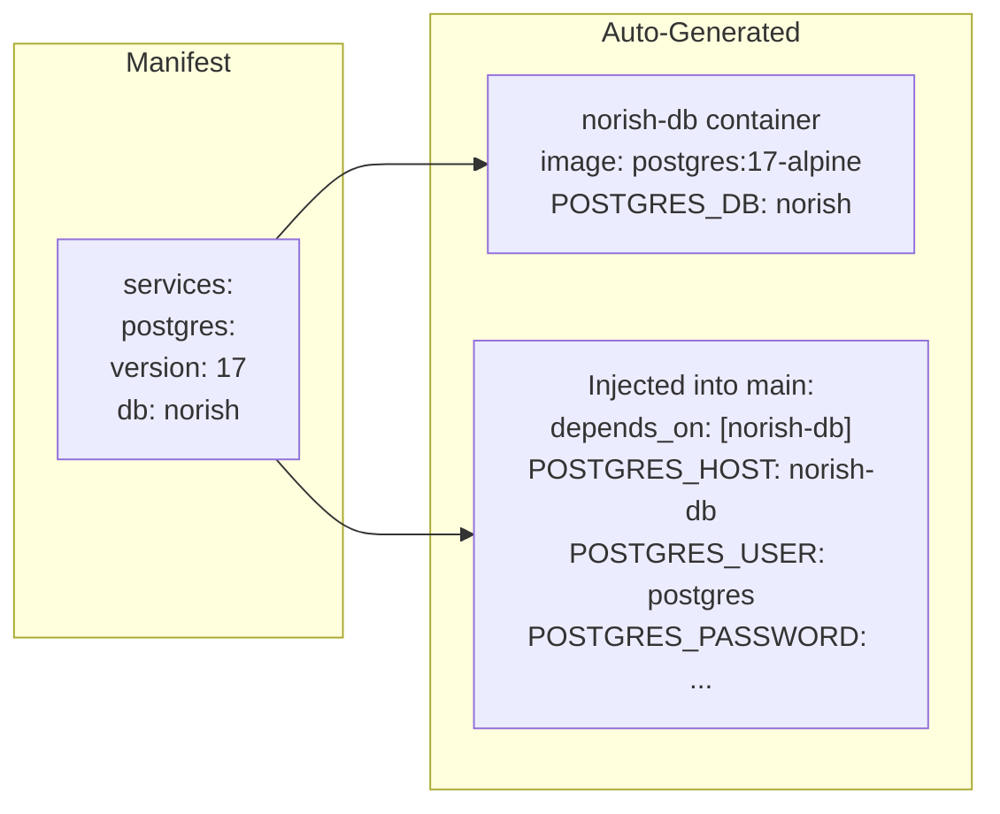
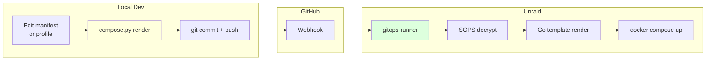

# ADR-0001: Manifest System

**Status:** Superseded by Go Implementation
**Date:** 2025-12-21
**Author:** Cameron + Claude

> **Note (2024-12):** This ADR documents the original Python implementation design. The manifest system has since been rewritten in Go as part of the bosun CLI. The core concepts (provisions, services, stacks, merge semantics) remain the same, but the implementation details differ:
> - Python `manifest.py` -> Go `bosun provision`
> - External CLI tools (git, sops, rsync, chezmoi) -> Pure Go libraries (go-git, go-sops, native file copy, text/template)
> - See [docs/architecture.md](../architecture.md) for current implementation details.

## Context

Managing 44+ Docker services across compose, Traefik, and Gatus configs leads to:
- Repetitive boilerplate (healthchecks, labels, networks)
- Inconsistency across services
- Forgotten monitoring endpoints
- Painful bulk updates (change healthcheck pattern → 44 edits)

No existing tool handles compose + reverse proxy + monitoring as a unified service definition.

## Decision

Build a lightweight **Manifest System** that:
1. Reads simple service manifests (~10 lines)
2. Merges reusable provisions (healthcheck, reverse-proxy, monitoring, etc.)
3. Outputs complete configs for yacht (compose), Traefik, and Gatus

## Architecture Diagrams

### High-Level Flow



### Three-Target Generation



### Render Pipeline



### Merge Semantics



### Sidecar Injection



### GitOps Integration



### Provision Composition (Mixin Pattern)

```mermaid
classDiagram
    class ServiceManifest {
        name: string
        provisions: list
        config: dict
        crew: dict
    }

    class ContainerProvision {
        yacht.services.*
        image, restart, TZ
    }

    class HealthcheckProvision {
        yacht.services.*.healthcheck
        test, interval, timeout
    }

    class ReverseProxyProvision {
        yacht.services.*.networks
        yacht.services.*.labels
        traefik.http.routers.*
        traefik.http.services.*
    }

    class MonitoringProvision {
        gatus.endpoints[]
        url, conditions, alerts
    }

    class PostgresProvision {
        yacht.services.${name}-db
        auto-inject env vars
    }

    ServiceManifest --> ContainerProvision : has-a
    ServiceManifest --> HealthcheckProvision : has-a
    ServiceManifest --> ReverseProxyProvision : has-a
    ServiceManifest --> MonitoringProvision : has-a
    ServiceManifest --> PostgresProvision : has-a
```

## Specification

### Service Manifest Format

```yaml
# services/norish.yml
name: norish

provisions:
  - container           # base docker service
  - healthcheck         # wget /health pattern
  - homepage            # dashboard labels
  - reverse-proxy       # exposed via proxy
  - auth                # requires authentication
  - monitoring          # gatus endpoint

config:
  image: norishapp/norish:latest
  port: 3000
  subdomain: recipes
  group: Apps
  icon: mdi-food
  description: Recipe manager
  networks:
    - proxynet
  env:
    OIDC_CLIENT_ID: norish
    OIDC_CLIENT_SECRET: "{{ $secrets.oidc.norish.client_secret }}"

crew:
  postgres:
    version: 17
    db: norish
  redis:
    version: 8
```

### Raw Passthrough Mode

For infrastructure or complex services that don't fit the provision model:

```yaml
# services/traefik.yml
name: traefik
type: raw

yacht:
  traefik:
    image: traefik:v3.2
    container_name: traefik
    restart: unless-stopped
    # ... full yacht spec, copied verbatim
```

### Master Include File

```yaml
# stacks/core.yml
include:
  # Provision-based
  - stirling-pdf.yml
  - llm-council.yml
  - norish.yml

  # Raw passthrough
  - traefik.yml
  - authelia.yml
  - gitops-runner.yml

networks:
  proxynet:
    external: true
  mcp-net:
    external: true
```

### Provisions

Provisions are YAML fragments merged into the final output. No logic, just templates.

| Provision | What it adds |
|-----------|--------------|
| `container` | Base service: image, container_name, restart, TZ, volumes |
| `healthcheck` | Healthcheck block with configurable endpoint |
| `homepage` | Homepage dashboard labels |
| `reverse-proxy` | Traefik router + service (no auth) |
| `auth` | Traefik authelia middleware |
| `monitoring` | Gatus endpoint definition |
| `postgres` | PostgreSQL crew (sidecar) service |
| `redis` | Redis crew (sidecar) service |

### Outputs

Running `manifest.py render stacks/core.yml` generates:

| Output | Description |
|--------|-------------|
| `output/yacht/core.yml` | Complete Docker Compose file |
| `output/traefik/dynamic.yml` | Traefik routers and services |
| `output/gatus/endpoints.yml` | Gatus monitoring endpoints |

### CLI Interface

```bash
# Render a stack
manifest.py render stacks/core.yml

# Render with dry-run (show diff)
manifest.py render stacks/core.yml --dry-run

# Validate manifests without rendering
manifest.py validate services/*.yml

# List available provisions
manifest.py provisions

# Show what a service expands to
manifest.py expand services/norish.yml
```

## Directory Structure

```
infrastructure/
├── manifest/
│   ├── manifest.py         # Main CLI (~100-150 lines)
│   ├── provisions/
│   │   ├── container.yml
│   │   ├── healthcheck.yml
│   │   ├── homepage.yml
│   │   ├── reverse-proxy.yml
│   │   ├── auth.yml
│   │   ├── monitoring.yml
│   │   ├── postgres.yml
│   │   └── redis.yml
│   ├── services/
│   │   ├── stirling-pdf.yml
│   │   ├── llm-council.yml
│   │   ├── norish.yml
│   │   ├── traefik.yml      # raw mode
│   │   └── ...
│   ├── stacks/
│   │   ├── core.yml         # infrastructure
│   │   ├── apps.yml         # user apps
│   │   └── mcp.yml          # MCP servers
│   └── output/              # generated files (gitignored)
│       ├── yacht/
│       ├── traefik/
│       └── gatus/
```

## Implementation

### Language: Python

- Maintainable, readable
- Good YAML libraries (ruamel.yaml preserves formatting)
- Easy to extend
- No external dependencies beyond stdlib + ruamel.yaml

### Core Logic Flow

The renderer executes in strict order for safety and predictability:

1. **Load Manifest** - Read service manifest, extract config block
2. **Load & Interpolate Provisions** - Load raw YAML strings, apply `${var}` substitution
   - **Constraint:** Missing variables = fatal error
3. **Parse & Normalize** - Parse interpolated strings, normalize `environment` and `labels` to Dicts
4. **Deep Merge** - Merge provision objects into three target accumulators (yacht, traefik, gatus)
5. **Crew Injection** - If `crew.<sidecar>` present, inject env vars and `depends_on`
6. **Apply Overrides** - Apply manifest's `yacht` block overrides
7. **Render** - Output files to `output/`

### Merge Semantics

| Type | Strategy | Example |
|------|----------|---------|
| Dictionaries | Recursive deep merge | labels, environment |
| Lists (default) | **Replace** | ports, volumes |
| Lists (exception) | **Set Union** | networks, depends_on |

**Why replace for lists:** Prevents "garbage collection" issues. Merging port lists could result in unwanted exposures. Later provisions overwrite earlier lists entirely.

### Provision Schema (Multi-Target)

Provisions organize fragments by target output file:

```yaml
# provisions/reverse-proxy.yml
yacht:
  services:
    ${name}:
      networks: ["proxynet"]  # Merged via Union
      labels:                  # Merged via Dict
        traefik.enable: "true"

traefik:
  http:
    routers:
      ${name}:
        rule: "Host(`${subdomain}.${domain}`)"
        service: ${name}
```

```yaml
# provisions/monitoring.yml
gatus:
  endpoints:
    - name: ${name}
      group: ${group}
      url: "https://${subdomain}.${domain}"
      interval: 60s
      conditions:
        - "[STATUS] == 200"
```

### Variable Interpolation

Variables are interpolated on **raw strings before YAML parsing** to preserve data types:

```yaml
# provisions/container.yml (raw)
yacht:
  services:
    ${name}:
      ports:
        - "${port}:${port}"  # Stays as string "3000:3000"
```

### Crew Contract

Crew (sidecars) are opinionated to maximize productivity:

**Postgres Provision:**
- Creates service: `${name}-db`
- Volume: `${name}_db_data:/var/lib/postgresql/data`
- **Auto-injects into main service:**
  - `depends_on: ["${name}-db"]`
  - `POSTGRES_HOST: ${name}-db`
  - `POSTGRES_USER`, `POSTGRES_DB`, `POSTGRES_PASSWORD` from config

**Escape hatch:** Don't use crew provision if non-standard setup needed. Use `type: raw` or manual env vars.

### SOPS Integration

Secrets stay as SOPS template syntax. Manifest renderer passes through unchanged:

```yaml
# In service manifest
env:
  API_KEY: "{{ $secrets.myapp.api_key }}"

# Output unchanged, SOPS decryption + Go templates handle at deploy time
```

## Guardrails

1. **Manifest renderer stays under 250 lines** - if bigger, we're over-engineering
2. **Max 10 provisions** - more means abstraction is wrong
3. **Provisions have no logic** - just YAML fragments with variable substitution
4. **Raw mode is the escape hatch** - don't handle every edge case
5. **No nested provisions** - provisions don't include other provisions
6. **Missing variables = hard error** - no silent failures
7. **Normalize environment/labels to Dicts** - simplifies merge logic

## Success Criteria

- New service: **< 5 minutes** from manifest to deployed
- Provision change: **< 1 minute** to update all services
- Learning curve: **< 15 minutes** to understand the system
- Debugging: Generated YAML is readable, not minified/mangled

## Alternatives Considered

| Alternative | Why not |
|-------------|---------|
| Helm | K8s only, heavyweight |
| Kustomize | K8s only |
| docker-compose `include` | Yacht only, no traefik/gatus |
| ytt | Another tool to learn, overkill |
| Jsonnet/Dhall/CUE | Real programming languages, overkill |
| VS Code snippets | Doesn't solve bulk updates |

## Risks

1. **Scope creep** - Mitigate: strict guardrails, raw escape hatch
2. **Edge cases pile up** - Mitigate: use raw mode, don't add flags
3. **Debugging complexity** - Mitigate: keep generated YAML clean, add `expand` command
4. **Adoption friction** - Mitigate: gradual migration, both modes work

## Phases

### Phase 1: Yacht Only
- Core renderer with multi-target provision schema
- 5 basic provisions (container, healthcheck, homepage, postgres, redis)
- Raw passthrough mode
- Merge semantics (dict merge, list replace, network union)
- Validate with 3 real services

### Phase 2: Traefik Integration
- reverse-proxy provision
- auth provision
- Generate traefik/dynamic.yml
- `manifest.py import` command to scaffold manifests from existing yacht files

### Phase 3: Gatus Integration
- monitoring provision
- Generate gatus/endpoints.yml

### Phase 4: Polish
- Dry-run diff output
- Validation command
- Error messages

## Unresolved Dissents

Minor implementation details deferred to developer discretion:

1. **Import Command Priority** - Some argue `import` is critical for Phase 1 adoption (44 services to migrate). Resolution: Build core renderer first; if manual migration too painful, prioritize import.

2. **Crew Opt-Out** - Disagreement on explicit `auto_inject: false` flag vs implicit "just don't use the provision". Resolution: Start implicit (convention over configuration); add flags only if edge cases abound.

3. **Networks Definition** - Should be in stack files for validation. Provisions reference by name; renderer validates referenced networks exist.

## Open Questions

1. **Stack organization** - One big core.yml or split by category (infra, apps, mcp)?
2. **Networks** - Defined in stack file or inferred from provisions?
3. **Volumes** - Standard pattern or per-service config?
4. **Secrets path convention** - `$secrets.app.key` or `$secrets.apps.app.key`?

## References

- [GitOps Workflow Guide](obsidian://open?vault=The%20Compendium&file=50%20-%20Home%20Info%2FNetwork%2FGitOps%20Workflow%20Guide)
- [Docker Compose Specification](https://docs.docker.com/compose/compose-file/)
- [Traefik Dynamic Configuration](https://doc.traefik.io/traefik/providers/file/)
