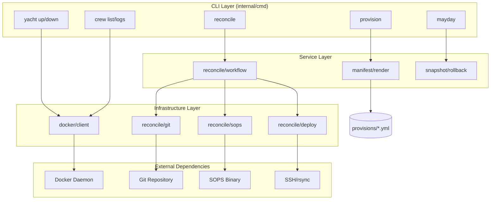
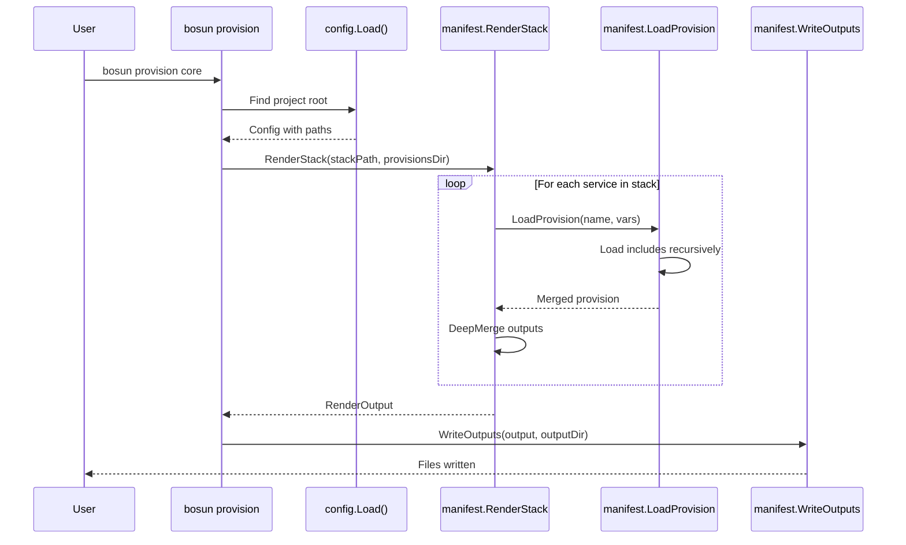
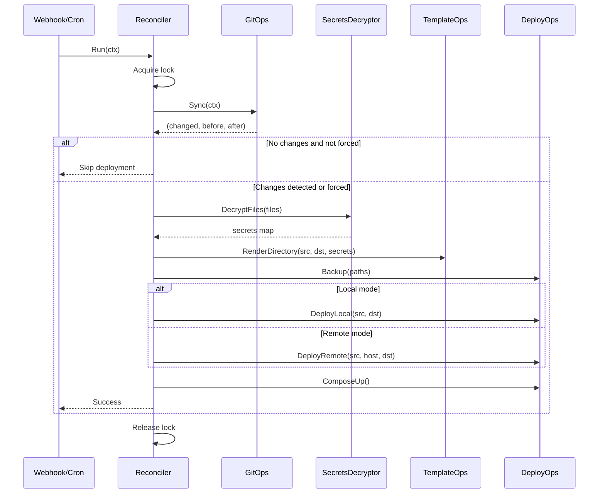

# Bosun Architecture

This document provides a comprehensive overview of bosun's architecture, design decisions, and extension points.

## System Overview

Bosun is a GitOps toolkit for Docker Compose deployments. It transforms declarative service manifests into Docker Compose, Traefik routing, and Gatus monitoring configurations, then deploys them via a reconciliation loop.

### What Bosun Is

- **Manifest-driven deployment** - Write 10 lines of YAML, generate complete compose/traefik/gatus configs
- **GitOps for Docker Compose** - Git push triggers deployment with secrets decryption and template rendering
- **Single binary CLI** - No runtime dependencies (Python, Node, etc.)
- **Homelab-focused** - Designed for self-hosters managing 10-100 containers

### Key Design Decisions

| Decision | Rationale |
|----------|-----------|
| Go | Single binary, native Docker SDK, easy cross-compilation |
| Docker Compose v2 | Ubiquitous, stable, no Kubernetes complexity |
| SOPS + Age | GitOps-friendly secrets (encrypted in repo) |
| Chezmoi templates | Mature templating with Go template syntax |
| Cobra CLI | Industry standard (kubectl, gh, hugo) |

### Target Users

- Self-hosters running Docker on Unraid, Debian, Ubuntu, or macOS
- Users wanting GitOps without Kubernetes overhead
- Developers comfortable with YAML and Docker Compose

## Package Structure

```
cmd/bosun/              # Entry point
  main.go               # Calls cmd.Execute()

internal/
  cmd/                  # CLI layer (Cobra commands)
    root.go             # Root command, version info
    yacht.go            # yacht up/down/restart/status
    crew.go             # crew list/logs/inspect/restart
    provision.go        # provision [stack] --dry-run --diff
    reconcile.go        # reconcile (GitOps workflow)
    emergency.go        # mayday (errors, rollback)
    diagnostics.go      # doctor, drift, lint, status
    comms.go            # radio test/status
    init.go             # Interactive setup wizard
    helpers.go          # Shared command utilities

  config/               # Configuration discovery
    config.go           # Find project root, load bosun.yaml

  docker/               # Docker SDK wrapper
    interface.go        # DockerAPI interface (mockable)
    client.go           # Real Docker SDK client
    containers.go       # Container operations
    compose.go          # Docker Compose operations

  manifest/             # YAML rendering engine
    types.go            # ServiceManifest, Provision, Stack
    render.go           # RenderService, RenderStack
    provision.go        # LoadProvision (with inheritance)
    merge.go            # DeepMerge with union/extend semantics
    interpolate.go      # ${var} substitution

  reconcile/            # GitOps reconciliation
    reconcile.go        # Orchestrates the workflow
    interfaces.go       # GitOperations, SecretsDecryptor
    git.go              # Clone, pull, detect changes
    sops.go             # SOPS decryption operations
    template.go         # Chezmoi template rendering
    deploy.go           # rsync, SSH, compose up
    validation.go       # Input validation

  snapshot/             # Rollback system
    snapshot.go         # Create, list, restore snapshots

  lock/                 # File-based locking
    lock.go             # Prevent concurrent operations

  preflight/            # Pre-flight checks
    preflight.go        # Binary availability checks

  ui/                   # Console output
    color.go            # Colored, nautical-themed output
```

## Layer Diagram



## Key Abstractions

### DockerAPI Interface

The `DockerAPI` interface enables testing without a running Docker daemon:

```go
// internal/docker/interface.go
type DockerAPI interface {
    Ping(ctx context.Context) (types.Ping, error)
    ContainerList(ctx context.Context, options container.ListOptions) ([]types.Container, error)
    ContainerInspect(ctx context.Context, containerID string) (types.ContainerJSON, error)
    ContainerLogs(ctx context.Context, container string, options container.LogsOptions) (io.ReadCloser, error)
    ContainerStart(ctx context.Context, containerID string, options container.StartOptions) error
    ContainerRestart(ctx context.Context, containerID string, options container.StopOptions) error
    ContainerRemove(ctx context.Context, containerID string, options container.RemoveOptions) error
    // ...
}
```

Tests inject a mock implementation via `NewTestableClient(mockAPI)`.

### Provision Inheritance

Provisions support `includes` for composition:

```yaml
# provisions/webapp.yml
includes: [container, reverse-proxy, monitoring]
compose:
  services:
    ${name}:
      healthcheck:
        test: ["CMD", "curl", "-f", "http://localhost:${port}/health"]
```

The inheritance chain is resolved depth-first with circular-include protection:

```go
// internal/manifest/provision.go
func loadProvisionInternal(provisionName string, variables map[string]any,
                          provisionsDir string, loaded map[string]bool) (*Provision, error) {
    if loaded[provisionName] {
        return &Provision{}, nil  // Prevent circular includes
    }
    loaded[provisionName] = true
    // ... load includes first, then merge this provision on top
}
```

### Merge Semantics

The `DeepMerge` function implements Docker Compose-compatible merge rules:

| Key Type | Behavior | Example |
|----------|----------|---------|
| `networks`, `depends_on` | Set union (no duplicates) | `[a, b] + [b, c] = [a, b, c]` |
| `endpoints` (Gatus) | Extend (append) | `[e1] + [e2] = [e1, e2]` |
| `environment`, `labels` | Normalize list to dict, then merge | `FOO=a + BAR=b = {FOO: a, BAR: b}` |
| Default lists | Replace | `[old] + [new] = [new]` |
| Nested maps | Recursive merge | Deep merge |

## Data Flow

### Manifest Rendering

```
┌────────────────┐     ┌────────────────┐
│ ServiceManifest│     │   Provisions   │
│   myapp.yml    │     │ container.yml  │
│                │     │ reverse-proxy  │
│ name: myapp    │     │ postgres.yml   │
│ provisions:... │     │ monitoring.yml │
└───────┬────────┘     └───────┬────────┘
        │                      │
        └──────────┬───────────┘
                   │
                   ▼
          ┌────────────────┐
          │ RenderService  │
          │                │
          │ 1. Load vars   │
          │ 2. Interpolate │
          │ 3. Load provisions
          │ 4. Merge outputs
          └────────┬───────┘
                   │
        ┌──────────┼──────────┐
        ▼          ▼          ▼
┌──────────┐ ┌──────────┐ ┌──────────┐
│ compose/ │ │ traefik/ │ │  gatus/  │
│ myapp.yml│ │dynamic.ym│ │endpoints │
└──────────┘ └──────────┘ └──────────┘
```

### GitOps Reconciliation

```
┌─────────────┐
│ Git Push    │ (or webhook, or cron)
└──────┬──────┘
       ▼
┌─────────────────────────────────────────────────┐
│                  Reconciler.Run                  │
│                                                  │
│  1. Acquire lock (prevent concurrent runs)      │
│  2. Sync repository (clone or pull)             │
│  3. Decrypt secrets (SOPS + Age)                │
│  4. Render templates (.tmpl files)              │
│  5. Create backup of current config             │
│  6. Deploy (rsync to target, compose up)        │
│  7. Cleanup staging directory                   │
│  8. Release lock                                │
│                                                  │
└─────────────────────────────────────────────────┘
       │
       ▼
┌─────────────┐
│ Containers  │ (traefik, authelia, gatus, apps)
└─────────────┘
```

## Extension Points

### Adding New Commands

1. Create a new file in `internal/cmd/`:

```go
// internal/cmd/newcmd.go
package cmd

import "github.com/spf13/cobra"

var newCmd = &cobra.Command{
    Use:   "newcmd",
    Short: "Description",
    RunE: func(cmd *cobra.Command, args []string) error {
        // Implementation
        return nil
    },
}

func init() {
    rootCmd.AddCommand(newCmd)
}
```

2. The `init()` function registers the command automatically.

### Adding New Output Targets

Currently supported targets: `compose`, `traefik`, `gatus`.

To add a new target (e.g., `homepage`):

1. Update `internal/manifest/types.go`:

```go
var TargetNames = []string{"compose", "traefik", "gatus", "homepage"}

type Provision struct {
    Compose  map[string]any `yaml:"compose,omitempty"`
    Traefik  map[string]any `yaml:"traefik,omitempty"`
    Gatus    map[string]any `yaml:"gatus,omitempty"`
    Homepage map[string]any `yaml:"homepage,omitempty"`  // New target
}
```

2. Update `RenderOutput` similarly.

3. Update `WriteOutputs` in `render.go` to handle the new target.

### Adding New Provision Templates

1. Create a provision file in `manifest/provisions/`:

```yaml
# manifest/provisions/redis.yml
compose:
  services:
    ${name}-redis:
      image: redis:${version}
      volumes:
        - ${name}-redis-data:/data
      networks:
        - ${name}-net
  volumes:
    ${name}-redis-data:
```

2. Reference in service manifests:

```yaml
name: myapp
provisions: [container, redis]
config:
  version: "7"
```

## Design Patterns

### Interface Abstraction (Docker)

The `DockerAPI` interface abstracts the Docker SDK, enabling:
- Unit testing without Docker daemon
- Potential future support for Podman or containerd
- Compile-time verification that the interface stays in sync

```go
// Compile-time verification
var _ DockerAPI = (dockerAPIAdapter)(nil)
```

### Composition (Provisions)

Provisions use composition via `includes` rather than inheritance:

```yaml
# webapp includes container + reverse-proxy + monitoring
includes: [container, reverse-proxy, monitoring]
```

Benefits:
- Flexible mixing of capabilities
- No deep inheritance hierarchies
- Clear override semantics (later includes override earlier)

### Retry with Exponential Backoff (SSH)

Remote operations use retry logic for transient failures:

```go
// internal/reconcile/deploy.go
func retryWithBackoff(ctx context.Context, maxRetries int, operation func() error) error {
    backoff := InitialBackoff  // 1s
    for attempt := 1; attempt <= maxRetries; attempt++ {
        if err := operation(); err != nil {
            if !isTransientSSHError(err) {
                return err  // Don't retry non-transient errors
            }
            backoff *= 2  // 1s -> 2s -> 4s
            time.Sleep(backoff)
            continue
        }
        return nil
    }
    return fmt.Errorf("failed after %d attempts", maxRetries)
}
```

### File-Based Locking

Prevents concurrent provisioning operations:

```go
// internal/lock/lock.go
func (l *Lock) Acquire() error {
    f, err := os.OpenFile(l.path, os.O_CREATE|os.O_RDWR, 0644)
    // Use syscall.Flock for atomic locking
    syscall.Flock(int(f.Fd()), syscall.LOCK_EX|syscall.LOCK_NB)
}
```

## Trade-offs

### Why Go (Not Bash/Python/Rust)

| Factor | Go | Bash | Python | Rust |
|--------|----|----|--------|------|
| Single binary | Yes | No | No | Yes |
| Docker SDK | Native | Shell exec | Docker-py | Docker-rs |
| Learning curve | Moderate | Low | Low | High |
| Cross-compilation | Easy | N/A | Complex | Moderate |
| Build time | Fast | N/A | N/A | Slow |

Go was chosen for the native Docker SDK (Docker itself is written in Go) and trivial cross-compilation for Linux deployment.

### Why Not Kubernetes

| Factor | Docker Compose | Kubernetes |
|--------|---------------|------------|
| Learning curve | Low | High |
| Resource overhead | Minimal | Significant |
| Networking | Simple | Complex |
| Single-node focus | Native | Possible but awkward |
| Homelab fit | Excellent | Overkill |

Bosun targets homelabs where Docker Compose is simpler, lighter, and sufficient.

### Why SOPS (Not Vault/Sealed Secrets/EJSON)

| Factor | SOPS + Age | HashiCorp Vault | Sealed Secrets | EJSON |
|--------|-----------|-----------------|----------------|-------|
| GitOps compatible | Yes | Requires agent | Kubernetes only | Yes |
| Runtime dependency | sops binary | Vault server | K8s cluster | ejson binary |
| Key management | age key file | Vault policies | Cluster key | ejson key |
| Complexity | Low | High | Medium | Low |

SOPS was chosen for GitOps compatibility (secrets can be committed encrypted) and simplicity (just a binary, no server).

## Sequence Diagrams

### Provision Command



### Reconcile Command



## Related Documents

- [ADR-0010: Go Rewrite](adr/0010-go-rewrite.md) - Why Go was chosen
- [ADR-0001: Manifest System](adr/0001-manifest-system.md) - Provision design
- [ADR-0008: Container vs Daemon](adr/0008-container-vs-daemon.md) - Deployment modes
- [Commands Reference](commands.md) - Full command documentation
- [Concepts](concepts.md) - High-level architecture diagrams
- [Manifest System](manifest-system.md) - Detailed manifest documentation
