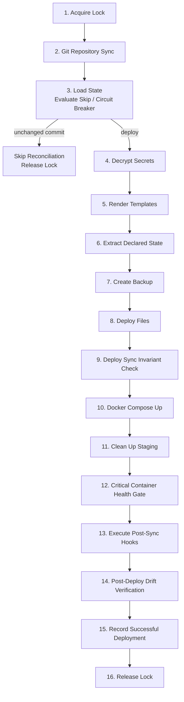

# Handoff: bosun architecture diagrams

**Written:** 2026-08-26 · **Repo:** `cameronsjo/bosun` · **Branch to start from:** `main`

## The ask

Redraw bosun's architecture diagrams as editorial diagrams using the
`diagram-design` plugin (installed 2026-08-26 from `cathrynlavery/diagram-design`).
Four Mermaid sources exist today; `diagram-design:import-mermaid` is the entry point.

## Current state

Four `.mmd` files on `main`, rendered by `scripts/diagrams/render.mjs` (pnpm):

| File | Covers |
|---|---|
| `docs/diagrams/reconcile-pipeline.mmd` | 16-step reconcile pipeline, lock to unlock |
| `docs/diagrams/locking-singleflight.mmd` | flock + dirty-flag coalescing |
| `docs/diagrams/architecture.mmd` | package/component layout |
| `docs/diagrams/pipeline-overview.mmd` | high-level GitOps flow |

## The one real finding — resolve this first

Two versions of `reconcile-pipeline.mmd` exist and **neither contains the other's
nodes**. `main` has one; the now-deleted branch `docs/436-refresh-diagrams`
(commit `6144455`) had the other.

- `main`: a `DeployGate` decision node, "Fail Closed if Missing",
  "Verify Writes / Transfer" — 16 steps.
- The branch: "Deploy Sync Invariant Check", "Circuit Breaker", a `Skip
  Reconciliation` edge — different ordering, also 16 steps.

PR #563 (`docs: refresh reconcile and locking diagrams`) merged 2026-08-24 and was
that branch's own PR, so the branch was *stale* rather than orphaned — `main` moved
on afterward. **But the divergence is not a fast-forward**, so do not assume `main`
is simply correct. Read `Run()` in `internal/reconcile/reconcile.go` and settle
which ordering matches the code before redrawing. Redrawing the wrong one produces
a beautiful diagram of a pipeline that does not exist.

The branch is deleted, so its version is reproduced here in full — this doc is the
only surviving copy:

Compare against `main`'s current `docs/diagrams/reconcile-pipeline.mmd`.

The other three `.mmd` files were byte-identical across branch and `main` — they
carry no such ambiguity.

## Suggested sequence

1. Read `Run()` in `internal/reconcile/reconcile.go`; write down the actual step order.
2. Pick the correct `reconcile-pipeline.mmd` (or synthesize a third that matches code).
3. Run `diagram-design:doctor` to confirm the plugin's environment is ready.
4. `diagram-design:import-mermaid` per file, choosing format/size/detail.
5. Export via `diagram-design:export-diagram` (writes `.svg` + `.png` beside the source).
6. Decide whether the editorial versions *replace* the Mermaid sources or sit
   alongside them — `scripts/diagrams/render.mjs` and any docs embedding the
   rendered output need updating either way.

## Loose ends

- `docs/436-refresh-diagrams` was deleted (local and remote) on 2026-08-26 after
  its content proved otherwise-landed. Its diagram is inlined above; nothing else
  on it was worth keeping. Commit `6144455` may still be reachable via reflog in
  the primary checkout, but do not count on it.

## Context from the session that wrote this

A branch sweep on 2026-08-26 cleared the repo from 107 remote branches to 3. All
five branches that initially survived the sweep turned out to be content-duplicates
of already-merged work (PRs #610, #611, #612 opened then closed as superseded by
#439, #597, #590). This divergent diagram is the only genuinely open question the
sweep produced.

Method note for whoever repeats that sweep: commit-count and head-SHA tests all
produced false positives, because squash-merge rewrites SHAs, a squash body can
carry two commit subjects while the PR title names one, and work can land under a
different branch name. `git diff origin/main <branch> -- <paths>` settles it and
costs the same.
