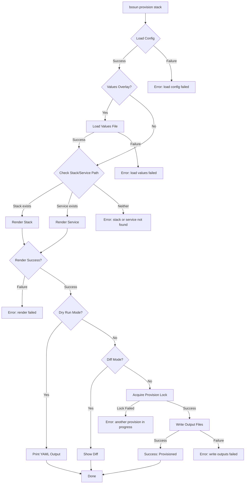
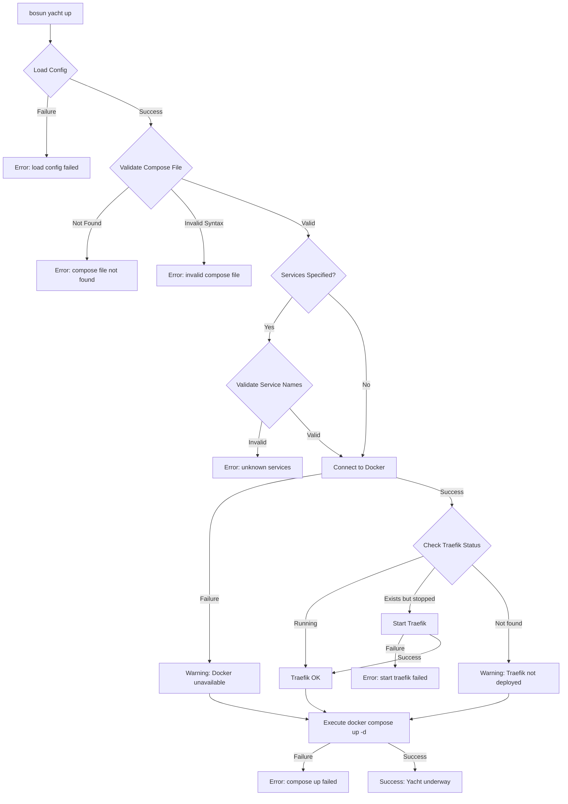
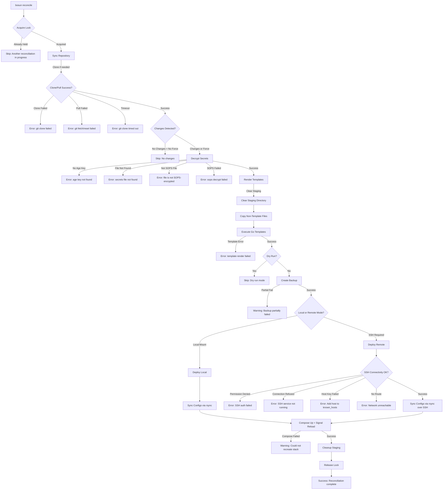
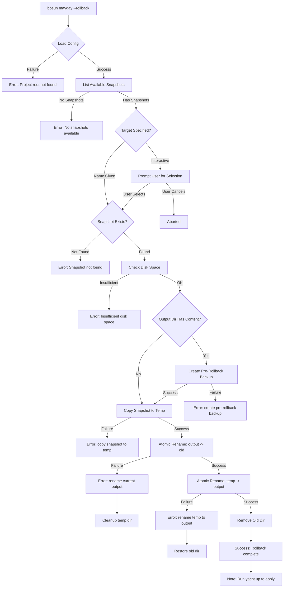
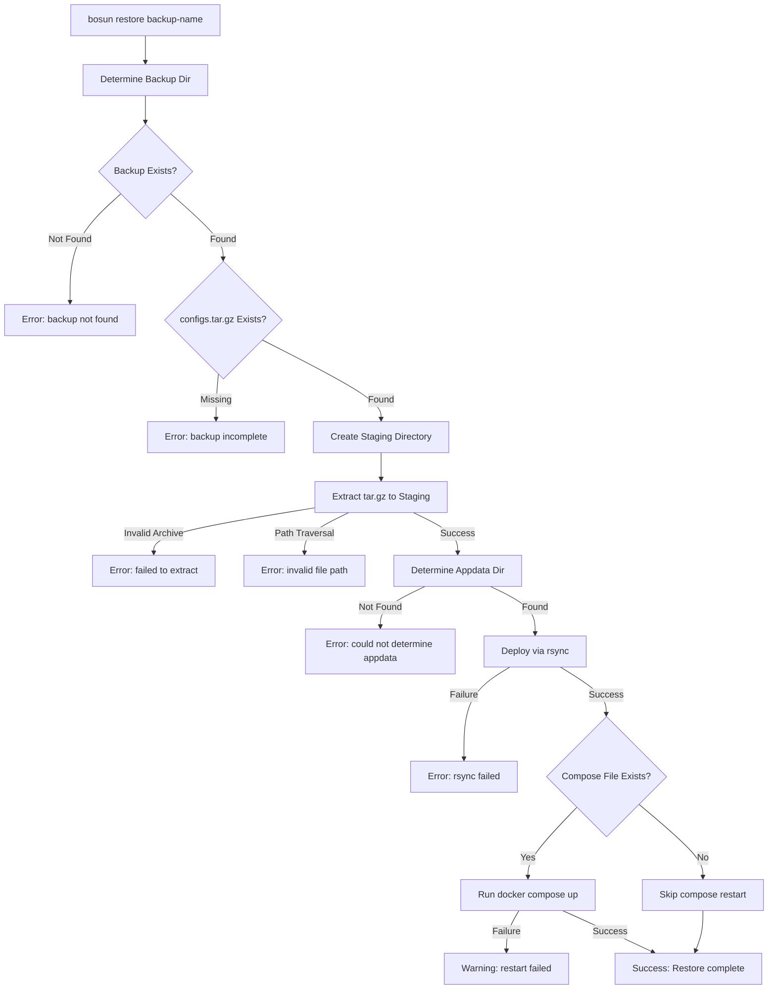
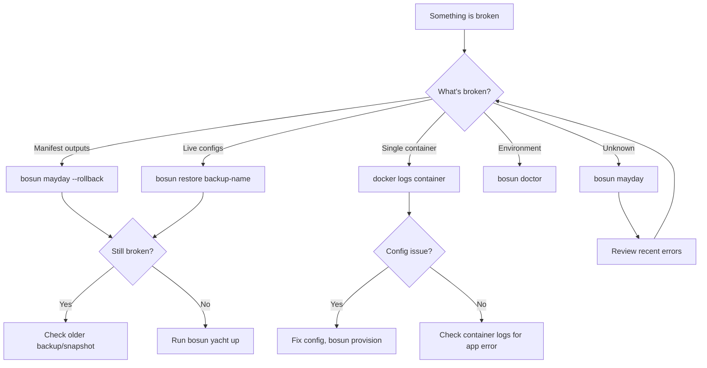

# Bosun Workflow Documentation

This document describes the happy and unhappy paths for all major operations in the bosun codebase, including error handling and recovery procedures.

## Table of Contents

- [1. Provision Workflow](#1-provision-workflow)
- [2. Yacht Up/Down/Restart Workflow](#2-yacht-updownrestart-workflow)
- [3. Reconcile/GitOps Workflow](#3-reconcilegitops-workflow)
- [4. Snapshot/Rollback Workflow](#4-snapshotrollback-workflow)
- [5. Doctor/Diagnostics Workflow](#5-doctordiagnostics-workflow)

---

## 1. Provision Workflow

The provision workflow renders manifest files into Docker Compose, Traefik, and Gatus configurations.

### Entry Points

- `bosun provision [stack]` - Render a stack or service manifest
- `bosun provisions` - List available provisions
- `bosun create <template> <name>` - Create a new service from template

### Flowchart



### Step-by-Step Description

| Step | Operation | Error Handling |
|------|-----------|----------------|
| 1 | Load configuration from `config.yaml` or defaults | Returns error if config cannot be loaded |
| 2 | Load values overlay file if `-f` flag provided | Returns error if file cannot be read or parsed |
| 3 | Check if argument is a stack or service | Returns "stack or service not found" if neither exists |
| 4 | Render stack (loads included services) or single service | Returns error with specific cause (missing provision, YAML parse error) |
| 5 | For each service, load provisions and interpolate variables | Returns error if provision not found or interpolation fails |
| 6 | Merge compose/traefik/gatus outputs | Deep merge with later values taking precedence |
| 7 | Dry run: print YAML to stdout | No file writes |
| 8 | Diff mode: compare against existing files | Shows new vs existing files |
| 9 | Acquire provision lock (prevents concurrent writes) | Returns error if lock held by another process |
| 10 | Write output files to `output/compose/`, `output/traefik/`, `output/gatus/` | Returns error on write failure, lock released on exit |

### Error Scenarios

| Error | Cause | Recovery |
|-------|-------|----------|
| `load config: ...` | Missing or invalid `config.yaml` | Create `config.yaml` or run from project root |
| `load values: ...` | Values overlay file not found or invalid YAML | Check file path and YAML syntax |
| `stack or service not found: X` | No `stacks/X.yml` or `services/X.yml` | Verify stack/service name, run `bosun provisions` |
| `load provision X: ...` | Provision template not found | Create provision in `provisions/X.yml` |
| `render stack: ...` | Service in stack failed to render | Check individual service file for errors |
| `acquire provision lock: ...` | Concurrent provision in progress | Wait for other provision to complete |
| `write outputs: ...` | Permission denied or disk full | Check directory permissions, disk space |

---

## 2. Yacht Up/Down/Restart Workflow

The yacht commands manage Docker Compose services with nautical theming.

### Entry Points

- `bosun yacht up [services...]` - Start services
- `bosun yacht down` - Stop and remove services
- `bosun yacht restart [services...]` - Restart services
- `bosun yacht status` - Show service status

### Flowchart



### Step-by-Step Description

| Step | Operation | Error Handling |
|------|-----------|----------------|
| 1 | Load configuration | Returns error with config path |
| 2 | Check compose file exists | Returns "compose file not found: path" |
| 3 | Run `docker compose config --quiet` to validate syntax | Returns "invalid compose file" with parser output |
| 4 | Parse compose YAML to extract service names | Returns error if YAML invalid |
| 5 | Validate provided service names exist | Returns "unknown services: X. Valid services: Y" |
| 6 | Connect to Docker daemon | Warning only, continues if fails |
| 7 | Check if Traefik container is running | Auto-starts if exists but stopped |
| 8 | Execute `docker compose up -d [services]` | Returns full compose error output |

### Error Scenarios

| Error | Cause | Recovery |
|-------|-------|----------|
| `compose file not found: X` | Compose file doesn't exist | Run `bosun provision` first |
| `invalid compose file: ...` | YAML syntax or schema error | Run `docker compose config` to debug |
| `unknown services: X` | Service name not in compose | Check available services in compose file |
| `Could not connect to Docker` | Docker daemon not running | Start Docker daemon |
| `traefik not found` | Traefik not deployed | Deploy Traefik before application services |
| `compose up: ...` | Container failed to start | Check `docker logs <container>` |

---

## 3. Reconcile/GitOps Workflow

The reconcile workflow implements GitOps: sync from git, decrypt secrets, render templates, deploy, and restart services.

### Entry Points

- `bosun reconcile` - Run full reconciliation
- Called automatically via webhook on git push

### Flowchart



### Step-by-Step Description

| Step | Operation | Error Handling |
|------|-----------|----------------|
| 1 | Acquire exclusive file lock (`/tmp/reconcile.lock`) | Skips if lock held (non-blocking `LOCK_NB`) |
| 2 | Sync git repository (clone or pull) | Clone timeout: 5min, Fetch timeout: 2min |
| 3 | Compare before/after commit hashes | Skip if no changes unless `--force` |
| 4 | Validate SOPS files exist and have `sops` metadata key | Returns specific error with fix instructions |
| 5 | Check Age key exists (`SOPS_AGE_KEY`, `SOPS_AGE_KEY_FILE`, or default path) | Returns error with setup instructions |
| 6 | Decrypt SOPS files to JSON map | Returns error with file path |
| 7 | Clear staging directory | Removes previous staging state |
| 8 | Copy non-template files to staging | Preserves directory structure |
| 9 | Execute Go templates with secrets | In-memory template rendering with Sprig functions |
| 10 | Create backup of current configs | Backup verification: check tar.gz is valid |
| 11 | Deploy via local rsync or SSH rsync | SSH retry with exponential backoff (1s, 2s, 4s) |
| 12 | Run `docker compose up -d --remove-orphans --wait` | Warning if fails (non-fatal) |
| 13 | Signal containers (SIGHUP for hot reload) | Warning if fails (non-fatal) |
| 14 | Cleanup staging directory | Warning if fails (non-fatal) |
| 15 | Release file lock | Always executed via defer |

### Error Scenarios

| Error | Cause | Recovery |
|-------|-------|----------|
| `git clone failed` | Auth failure, network, invalid repo | Check SSH keys, network, repo URL |
| `git clone timed out after 5m` | Slow network or large repo | Retry, or check network |
| `git fetch timed out after 2m` | Network issues | Retry on next trigger |
| `age key not found` | No SOPS decryption key | Run `age-keygen -o ~/.config/sops/age/keys.txt` |
| `file is not SOPS-encrypted` | Missing `sops` metadata | Encrypt file: `sops --encrypt --in-place file.yaml` |
| `sops decrypt failed` | Wrong key or corrupted file | Verify age key matches encryption key |
| `template render failed` | Template syntax error | Fix template, check error output |
| `SSH authentication failed` | Invalid SSH key | Add key to remote authorized_keys |
| `SSH connection refused` | SSH service not running | Start SSH service on remote |
| `SSH host key verification failed` | Unknown host | Run `ssh-keyscan host >> ~/.ssh/known_hosts` |
| `rsync timed out after 5m` | Large files or slow network | Retry, reduce file sizes |
| `docker compose up failed` | Container startup error | Check container logs, compose file |

### SSH Retry Logic

Remote operations use exponential backoff for transient errors:

```
Transient errors (will retry):
- connection refused
- connection reset
- connection timed out
- network is unreachable
- no route to host
- host is down
- operation timed out
- i/o timeout
- temporary failure

Backoff sequence: 1s -> 2s -> 4s (max 3 retries)
```

---

## 4. Snapshot/Rollback Workflow

The snapshot workflow provides point-in-time backups of manifest outputs for quick recovery.

### Entry Points

- Automatic: Snapshot created before each `bosun provision`
- `bosun mayday --list` - List available snapshots
- `bosun mayday --rollback [name]` - Restore a snapshot
- `bosun restore --list` - List reconcile backups
- `bosun restore <backup-name>` - Restore a reconcile backup

### Flowchart (Snapshot/Rollback)



### Flowchart (Reconcile Restore)



### Step-by-Step Description

| Step | Operation | Error Handling |
|------|-----------|----------------|
| 1 | List snapshots in `.bosun/snapshots/` directory | Sorted by date, newest first |
| 2 | Verify target snapshot exists | Returns "snapshot not found: name" |
| 3 | Calculate snapshot size for disk check | Returns error if unable to stat files |
| 4 | Check available disk space (snapshot size + 100MB buffer) | Returns "insufficient disk space" |
| 5 | Create pre-rollback backup of current state | Stored as `pre-rollback-YYYYMMDD-HHMMSS` |
| 6 | Copy snapshot to temp directory | Atomic restore pattern |
| 7 | Rename current output to `.restore-old-*` | Preserves original on failure |
| 8 | Rename temp to output (atomic swap) | Restores old on failure |
| 9 | Remove old directory | Cleanup after success |
| 10 | Display restored files | User notification |

### Error Scenarios

| Error | Cause | Recovery |
|-------|-------|----------|
| `Project root not found` | Not in bosun project | cd to project directory |
| `No snapshots available` | Never provisioned or snapshots deleted | Run `bosun provision` first |
| `Snapshot not found: X` | Invalid snapshot name | Run `bosun mayday --list` |
| `insufficient disk space` | Disk full | Free disk space or delete old snapshots |
| `create pre-rollback backup` | Permission or disk space | Check permissions, free space |
| `rename current output` | Permission denied | Check directory ownership |
| `backup archive is corrupted` | Tar file damaged | Use different backup |
| `invalid file path in archive` | Path traversal attempt | Backup may be compromised |

### Snapshot Retention

- Maximum 20 snapshots retained
- Oldest snapshots automatically deleted when limit exceeded
- Minimum 100MB free disk space required for new snapshots

---

## 5. Doctor/Diagnostics Workflow

The doctor workflow runs pre-flight checks to verify the environment is properly configured.

### Entry Points

- `bosun doctor` - Run all diagnostic checks
- `bosun status` - Show running services dashboard
- `bosun drift` - Detect configuration drift
- `bosun lint [target]` - Validate manifests

### Flowchart (Doctor)

```mermaid
flowchart TD
    A[bosun doctor] --> B[Check Docker Running]

    B -->|Ping Success| B_OK[* Docker is running]
    B -->|Ping Fail| B_FAIL[x Docker is not running]
    B -->|Not Installed| B_FAIL2[x Docker not installed]

    B_OK --> C
    B_FAIL --> C
    B_FAIL2 --> C

    C[Check Docker Compose v2] --> D{compose version?}
    D -->|Found| D_OK[* Docker Compose v2 version]
    D -->|Not Found| D_FAIL[x Docker Compose v2 not found]

    D_OK --> E
    D_FAIL --> E

    E[Check Git] --> F{git installed?}
    F -->|Yes| F_OK[* Git is installed]
    F -->|No| F_FAIL[x Git not found]

    F_OK --> G
    F_FAIL --> G

    G[Check Project Root] --> H{config found?}
    H -->|Yes| H_OK[* Project root found: path]
    H -->|No| H_WARN[! Project root not found]

    H_OK --> I
    H_WARN --> I

    I[Check Age Key] --> J{key exists?}
    J -->|SOPS_AGE_KEY set| J_OK[* Age key found]
    J -->|SOPS_AGE_KEY_FILE exists| J_OK
    J -->|Default path exists| J_OK
    J -->|Not Found| J_WARN[! Age key not found]

    J_OK --> K
    J_WARN --> K

    K[Check SOPS] --> L{sops installed?}
    L -->|Yes| L_OK[* SOPS is installed version]
    L -->|No| L_WARN[! SOPS not found]

    L_OK --> M
    L_WARN --> M

    M[Check uv] --> N{uv installed?}
    N -->|Yes| N_OK[* uv is installed]
    N -->|No| N_WARN[! uv not found]

    N_OK --> O
    N_WARN --> O

    O[Check Manifest Directory] --> P{manifest dir exists?}
    P -->|Yes| P_OK[* Manifest directory found]
    P -->|No| P_WARN[! Manifest directory not found]

    P_OK --> Q
    P_WARN --> Q

    Q[Check Webhook] --> R{HTTP health OK?}
    R -->|200 OK| R_OK[* Webhook endpoint responding]
    R -->|Other| R_WARN[! Webhook not responding]

    R_OK --> S
    R_WARN --> S

    S[Summary] --> T{failed > 0?}
    T -->|Yes| T_FAIL[Ship not seaworthy! Exit 1]
    T -->|No| U{warned > 0?}
    U -->|Yes| U_WARN[Ship can sail, check warnings]
    U -->|No| V[All systems go! Ready to sail]
```



### Check Categories

| Check | Type | Fix Instructions |
|-------|------|------------------|
| Docker Running | REQUIRED | `systemctl start docker` or start Docker Desktop |
| Docker Compose v2 | REQUIRED | Install Docker Desktop or compose plugin |
| Git Installed | REQUIRED | Install via package manager |
| Project Root | WARNING | Run from project directory with config.yaml |
| Age Key | WARNING | `age-keygen -o ~/.config/sops/age/keys.txt` |
| SOPS | WARNING | Install via package manager |
| uv | WARNING | `curl -LsSf https://astral.sh/uv/install.sh \| sh` |
| Manifest Directory | WARNING | Create `manifest/` directory |
| Webhook Endpoint | WARNING | Start bosun container |

### Exit Codes

| Code | Meaning |
|------|---------|
| 0 | All required checks passed (warnings allowed) |
| 1 | One or more required checks failed |

### Lint Checks

The `bosun lint` command validates manifests:

| Check | Description |
|-------|-------------|
| Provisions exist | Verifies `provisions/` directory has templates |
| Service files valid | YAML parseable, has `name:` and `provisions:` |
| Stack files valid | YAML parseable, has `include:` |
| Dependencies | Services with `-db` suffix should be in `depends_on` |
| Network config | Traefik-enabled services should be on `proxynet` |
| Port conflicts | No duplicate host port bindings |
| Dependency cycles | No circular `depends_on` references |

---

## Recovery Procedures Summary

### Quick Reference

| Scenario | Command | Notes |
|----------|---------|-------|
| Manifest render broken | `bosun mayday --rollback` | Restore previous snapshot |
| GitOps deploy broken | `bosun restore <backup>` | Restore from reconcile backup |
| Container won't start | `docker logs <container>` | Check container logs |
| Check environment | `bosun doctor` | Verify all dependencies |
| See what's running | `bosun status` | Dashboard of services |
| Detect drift | `bosun drift` | Git vs running state |
| Validate before deploy | `bosun lint` | Check manifests |
| Emergency container remove | `bosun overboard <name>` | Force remove container |

### Recovery Decision Tree



---

## Timeout Constants

| Operation | Timeout | Source |
|-----------|---------|--------|
| Git clone | 5 minutes | `GitCloneTimeout` |
| Git fetch | 2 minutes | `GitFetchTimeout` |
| Git local ops | 30 seconds | `GitLocalTimeout` |
| SSH connect | 5 seconds | `SSHConnectTimeout` |
| SSH operations | 30 seconds | `SSHTimeout` |
| Rsync | 5 minutes | `RsyncTimeout` |
| Docker compose up | 10 minutes | `ComposeUpTimeout` |
| Doctor checks | 10 seconds | `doctorCheckTimeout` |
| HTTP client | 5 seconds | `httpClientTimeout` |
| Docker ping | 5 seconds | `dockerPingTimeout` |
